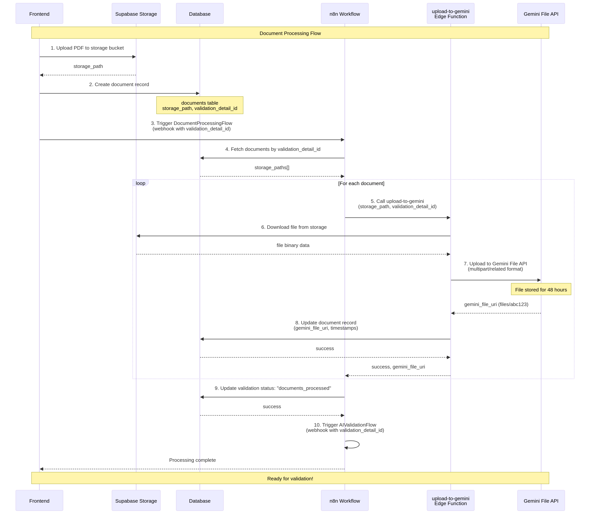

# NytroAI

**AI-powered RTO assessment validation using Gemini 2.0 for maximum accuracy and compliance.**

[](https://opensource.org/licenses/MIT)
[](https://supabase.com)
[](https://n8n.io)
[](https://ai.google.dev/gemini-api)

---

## Overview

NytroAI validates RTO (Registered Training Organisation) assessment documents against unit requirements using Google's Gemini 2.0 API. The system validates **each requirement individually** for maximum accuracy, with comprehensive citations and smart question generation.

###Key Features

- ✅ **Individual requirement validation** - One requirement at a time for maximum accuracy
- ✅ **Session context isolation** - Prevents cross-contamination between validations
- ✅ **Rich citations** - Document names, page numbers, and excerpts
- ✅ **Smart questions** - AI-generated questions for gaps
- ✅ **Multi-document support** - Validates across multiple PDFs
- ✅ **Real-time progress tracking** - See validation status as it runs
- ✅ **Database-driven prompts** - Easy to update and version
- ✅ **Rate limit handling** - Automatic retry and backoff

---

## Architecture


### Components

| Component | Technology | Purpose |
|-----------|-----------|---------|
| **Frontend** | React/Next.js (Netlify) | User interface for uploads and results |
| **Database** | Supabase PostgreSQL | Stores requirements, results, and metadata |
| **Storage** | Supabase Storage | Stores uploaded PDF documents |
| **Workflows** | n8n (self-hosted) | Orchestrates processing and validation |
| **Edge Functions** | Supabase Deno | Handles Gemini uploads and database queries |
| **AI** | Gemini 2.0 Flash | Validates requirements with 1M context |

### Why This Architecture?

**Simple**: 3 platforms (Supabase, n8n, Gemini) instead of 5+  
**Cost-effective**: $35-85/month for 100 validations  
**Accurate**: Individual validation prevents confusion  
**Scalable**: Handles 1000+ page documents  
**Reliable**: Rate limiting and retry logic built-in  

---

## Costs & Rate Limits

### Monthly Costs (100 validations/month)

| Component | Tier | Cost | Notes |
|-----------|------|------|-------|
| **Supabase** | Pro | $25/mo | Database + storage |
| **n8n** | Self-hosted | $10/mo | VM hosting (2 vCPU, 4GB RAM) |
| **Gemini API** | Free | $0/mo | Up to 1,500 RPD |
| **Netlify** | Free | $0/mo | Hosting |
| **Total (Free Gemini)** | | **$35/mo** | |
| | | | |
| **Gemini API** | Paid | $50/mo | 1000 RPM, better SLA |
| **Total (Paid Gemini)** | | **$85/mo** | |

### Per Validation Costs

**Free tier**: $0.50 per validation (50 requirements × $0.01)  
**Paid tier**: $0.50 per validation (same cost, faster)

**Cost breakdown per validation**:
- Gemini API: $0.50 (50 requirements × ~200K tokens × $0.15/1M input + $0.60/1M output)
- Supabase: $0.00 (included in Pro plan)
- n8n: $0.00 (included in hosting)

### Rate Limits

| Tier | RPM | RPD | Cost | Use Case |
|------|-----|-----|------|----------|
| **Free** | 15 | 1,500 | $0 | Development, testing, low volume |
| **Paid** | 1,000 | 50,000 | $50/mo | Production, high volume |

**Validation time**:
- Free tier: 3-4 minutes (50 requirements ÷ 15 RPM)
- Paid tier: 60-90 seconds (50 requirements ÷ 1000 RPM)

---

## Validation Strategy

### Individual Requirement Validation

NytroAI validates **each requirement individually** rather than in batches. This approach was chosen for **maximum accuracy**.

#### Why Individual Validation?

| Aspect | Individual | Batch |
|--------|-----------|-------|
| **Accuracy** | ⭐⭐⭐⭐⭐ Excellent | ⭐⭐⭐ Good |
| **Reasoning** | Clear, focused | Can be confused |
| **Citations** | Precise | May mix up sources |
| **Debugging** | Easy to verify | Hard to debug |
| **Cost** | $0.50/validation | $0.07/validation |
| **Speed** | 3-4 min (free) | 30 sec |

**Decision**: Accuracy is the top priority, so we use individual validation.

#### How It Works

```
For each validation (e.g., TLIF0006):
  1. Upload documents to Gemini File API (once)
  2. Get all requirements (50 items)
  3. For EACH requirement:
     a. Build prompt with full session context
     b. Include ALL documents (via file URIs)
     c. Validate ONE requirement
     d. Get detailed result with citations
     e. Save to validation_results table
     f. Update progress (1/50, 2/50, etc.)
  4. Takes ~3 minutes (free) or ~60 seconds (paid)
  5. Costs ~$0.50 total
```

#### Session Context Isolation

Each validation has a unique **session context** to prevent cross-contamination:

```
Session ID: 123
Session Created: 2025-01-28 10:30:00
Unit Code: TLIF0006
RTO Code: 7148
Documents: 
  - TLIF0006_Assessment.pdf (uploaded 2025-01-28 10:30:00)
  - TLIF0006_LearnerGuide.pdf (uploaded 2025-01-28 10:30:15)

IMPORTANT: Only consider documents from THIS session!
```

This ensures that if multiple users validate the same unit, their documents don't get mixed up.

#### Simple File API (Not File Search Stores)

We use Gemini's **simple File API**, not File Search Stores:

```
Upload → files/abc123 → Pass to generateContent
```

**Benefits**:
- ✅ Simple (no stores, no operations)
- ✅ Immediate URI
- ✅ 48-hour expiry (enough for validation)
- ✅ No complexity

**Why not File Search Stores?**
- ❌ Complex (stores, operations, polling)
- ❌ Store ID vs Name confusion
- ❌ Only needed for RAG/semantic search
- ❌ Overkill for validation use case

---

## Quick Start

### Prerequisites

- Node.js 18+
- Supabase account
- n8n instance (self-hosted or cloud)
- Gemini API key ([get one here](https://aistudio.google.com/app/apikey))

### 1. Clone Repository

```bash
git clone https://github.com/KevinDyerAU/NytroAI.git
cd NytroAI
```

### 2. Set Up Supabase

```bash
# Install Supabase CLI
npm install -g supabase

# Link to your project
supabase link --project-ref your-project-ref

# Run migrations
supabase db push

# Deploy edge functions
supabase functions deploy upload-to-gemini
supabase functions deploy get-requirements

# Set secrets
supabase secrets set GEMINI_API_KEY=your_gemini_api_key
```

### 3. Set Up n8n

```bash
# Import workflows
# 1. Go to n8n → Workflows → Import from File
# 2. Import n8n-flows/DocumentProcessingFlow_Gemini.json
# 3. Import n8n-flows/AIValidationFlow_Gemini_Enhanced.json

# Configure credentials
# 1. Supabase API (URL + service role key)
# 2. Gemini API (API key)

# Set environment variables
GEMINI_API_KEY=your_gemini_api_key
GEMINI_TIER=free  # or 'paid'
```

### 4. Set Up Frontend

```bash
# Install dependencies
npm install

# Configure environment
cp .env.local.example .env.local
# Edit .env.local with your Supabase and n8n URLs

# Run development server
npm run dev
```

### 5. Test End-to-End

```bash
# 1. Upload a test document (PDF)
# 2. Trigger document processing
# 3. Trigger validation
# 4. View results in Results Explorer
```

**See [IMPLEMENTATION_GUIDE.md](docs/IMPLEMENTATION_GUIDE.md) for detailed setup instructions.**

---

## Workflows

### 1. Document Processing Flow



**Purpose**: Upload documents to Gemini File API

**Steps**:
1. User uploads PDF to Supabase Storage
2. n8n workflow triggered
3. Edge function downloads file and uploads to Gemini
4. Gemini file URI saved to database
5. Ready for validation

**Time**: ~30 seconds per document

### 2. AI Validation Flow


**Purpose**: Validate each requirement individually

**Steps**:
1. User triggers validation
2. n8n fetches requirements and documents
3. For each requirement:
   - Fetch prompt template
   - Build request with session context
   - Call Gemini API
   - Save result to database
4. Update validation status

**Time**: 3-4 minutes (free tier) or 60-90 seconds (paid tier)

---

## Documentation

### Getting Started

- **[IMPLEMENTATION_GUIDE.md](docs/IMPLEMENTATION_GUIDE.md)** - Complete deployment guide (30-60 min)
- **[TECHNICAL_SPECIFICATIONS.md](docs/TECHNICAL_SPECIFICATIONS.md)** - Specs, costs, performance, limits
- **[DEPLOYMENT_GUIDE.md](docs/DEPLOYMENT_GUIDE.md)** - Production deployment guide

### Architecture & Strategy

- **[VALIDATION_STRATEGY.md](docs/VALIDATION_STRATEGY.md)** - Individual vs batch validation analysis
- **[INDIVIDUAL_VALIDATION_ARCHITECTURE.md](docs/INDIVIDUAL_VALIDATION_ARCHITECTURE.md)** - System architecture
- **[ENHANCED_WORKFLOW_SUMMARY.md](docs/ENHANCED_WORKFLOW_SUMMARY.md)** - Enhanced workflow summary

### Prompts & Validation

- **[PROMPTS.md](docs/PROMPTS.md)** - Complete prompt system documentation (77KB)
- **[WORKFLOW_COMPARISON.md](docs/WORKFLOW_COMPARISON.md)** - Workflow comparison

### API & Integration

- **[API_REFERENCE.md](docs/API_REFERENCE.md)** - Complete API reference with curl examples
- **[FRONTEND_INTEGRATION.md](docs/FRONTEND_INTEGRATION.md)** - Frontend integration guide

### Technical Deep Dives

- **[FILE_MOUNTING_LOGIC.md](docs/FILE_MOUNTING_LOGIC.md)** ⭐ - Critical Gemini file URI mounting explained
- **[FILE_MOUNTING_VERIFICATION.md](docs/FILE_MOUNTING_VERIFICATION.md)** - Verification that file mounting is correct

### n8n Workflows

- **[n8n-flows/README.md](n8n-flows/README.md)** - n8n workflows overview
- **[AIValidationFlow_Gemini_Enhanced_README.md](n8n-flows/AIValidationFlow_Gemini_Enhanced_README.md)** - Enhanced workflow details

### Complete Index

See **[docs/INDEX.md](docs/INDEX.md)** for the complete documentation index with role-based navigation and learning paths.

---

## Database Schema

### Key Tables

| Table | Purpose |
|-------|---------|
| `validation_details` | Validation sessions (unit, RTO, status) |
| `documents` | Uploaded documents with Gemini file URIs |
| `validation_results` | Individual requirement results (one row per requirement) |
| `prompts` | Prompt templates for each requirement type |
| `knowledge_evidence` | Knowledge requirements |
| `performance_evidence` | Performance requirements |
| `foundation_skills` | Foundation skills requirements |
| `assessment_conditions` | Assessment conditions |

### Validation Results Schema

```sql
CREATE TABLE validation_results (
  id BIGSERIAL PRIMARY KEY,
  validation_detail_id BIGINT REFERENCES validation_details(id),
  requirement_type TEXT NOT NULL,  -- 'KE', 'PE', 'FS', 'AC', 'E_PC'
  requirement_number TEXT,
  requirement_text TEXT,
  status TEXT NOT NULL,  -- 'met', 'partially_met', 'not_met', 'not_found'
  reasoning TEXT,
  mapped_content TEXT,
  unmapped_content TEXT,
  recommendations TEXT,
  citations JSONB,  -- [{document_name, location, content, relevance}]
  smart_questions JSONB,  -- [{question, purpose, expected_answer}]
  metadata JSONB,  -- {confidence_score, documents_analyzed, session_context, etc.}
  created_at TIMESTAMPTZ DEFAULT NOW()
);
```

**See [TECHNICAL_SPECIFICATIONS.md](docs/TECHNICAL_SPECIFICATIONS.md) for complete schema.**

---

## Development

### Project Structure

```
NytroAI/
├── src/                          # Frontend (React/Next.js)
│   ├── components/               # UI components
│   ├── services/                 # API services
│   └── hooks/                    # React hooks
│
├── supabase/
│   ├── migrations/               # Database migrations
│   └── functions/                # Edge functions
│       ├── upload-to-gemini/     # Upload to Gemini File API
│       └── get-requirements/     # Fetch requirements from DB
│
├── n8n-flows/                    # n8n workflow JSON files
│   ├── DocumentProcessingFlow_Gemini.json
│   └── AIValidationFlow_Gemini_Enhanced.json
│
└── docs/                         # Documentation
    ├── diagrams/                 # Architecture diagrams
    ├── guides/                   # Deployment guides
    └── archive/                  # Historical documentation
```

### Running Locally

```bash
# Frontend
npm run dev

# Supabase (local)
supabase start
supabase db reset  # Reset database
supabase functions serve  # Serve edge functions locally

# n8n (local)
docker run -p 5678:5678 n8nio/n8n
```

### Testing

```bash
# Run tests
npm test

# Test edge functions
supabase functions serve upload-to-gemini
curl -X POST http://localhost:54321/functions/v1/upload-to-gemini \
  -H "Authorization: Bearer $SUPABASE_SERVICE_ROLE_KEY" \
  -H "Content-Type: application/json" \
  -d '{"storage_path": "test.pdf", "validation_detail_id": 1}'
```

---

## Troubleshooting

### Common Issues

**1. Gemini API 400 Error: "Multipart body does not contain 2 or 3 parts"**

**Solution**: Use the `upload-to-gemini` edge function instead of calling Gemini directly from n8n. The edge function handles the complex multipart/related format correctly.

**2. Validation stuck at "processing"**

**Solution**: Check n8n workflow execution logs. Likely causes:
- Rate limit exceeded (wait or upgrade to paid tier)
- Gemini API key invalid
- Documents not uploaded to Gemini yet

**3. Citations missing document names**

**Solution**: Ensure documents table has `file_name` and `document_type` columns populated. The enhanced workflow includes this metadata automatically.

**4. Cross-contamination between validations**

**Solution**: The enhanced workflow includes session context isolation. Ensure you're using `AIValidationFlow_Gemini_Enhanced.json`, not the older workflows.

**See [TECHNICAL_SPECIFICATIONS.md](docs/TECHNICAL_SPECIFICATIONS.md) for more troubleshooting.**

---

## Contributing

We welcome contributions! Please see [CONTRIBUTING.md](CONTRIBUTING.md) for guidelines.

### Development Workflow

1. Fork the repository
2. Create a feature branch (`git checkout -b feature/amazing-feature`)
3. Commit your changes (`git commit -m 'Add amazing feature'`)
4. Push to the branch (`git push origin feature/amazing-feature`)
5. Open a Pull Request

---

## License

This project is licensed under the MIT License - see the [LICENSE](LICENSE) file for details.

---

## Acknowledgments

- **Google Gemini** - AI validation engine
- **Supabase** - Backend infrastructure
- **n8n** - Workflow automation
- **Netlify** - Frontend hosting

---

## Support

- **Documentation**: [docs/INDEX.md](docs/INDEX.md)
- **Issues**: [GitHub Issues](https://github.com/KevinDyerAU/NytroAI/issues)
- **Discussions**: [GitHub Discussions](https://github.com/KevinDyerAU/NytroAI/discussions)

---

## Changelog

See [CHANGELOG.md](CHANGELOG.md) for version history and release notes.

---

**Built with ❤️ for RTO compliance and validation**
