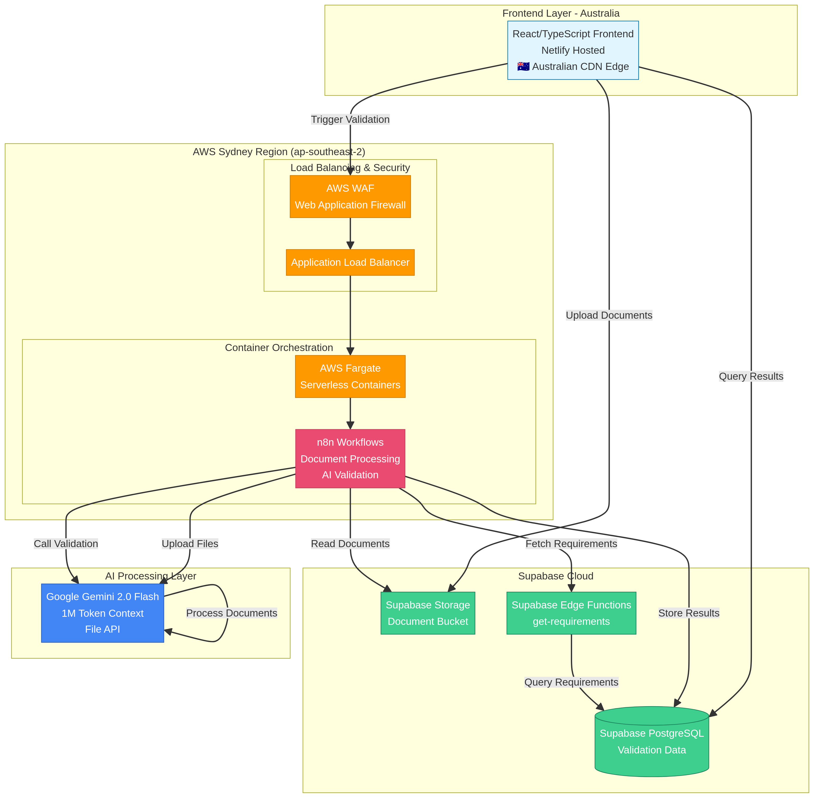
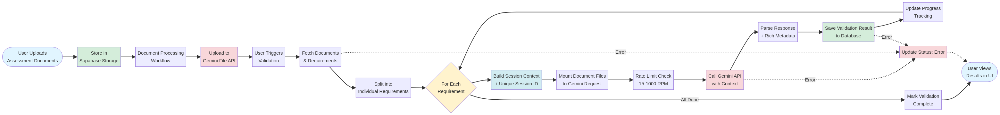

# NytroAI: AI-Powered RTO Assessment Validation

**AI-powered RTO assessment validation using Gemini 2.0 for maximum accuracy and compliance.**

[](https://opensource.org/licenses/MIT)
[](https://supabase.com)
[](https://n8n.io)
[](https://ai.google.dev/gemini-api)

---

## 1. Overview

NytroAI validates RTO (Registered Training Organisation) assessment documents against unit requirements using Google's Gemini 2.0 API. The system validates **each requirement individually** for maximum accuracy, with comprehensive citations and smart question generation.

This new, simplified architecture significantly reduces complexity and operational costs while enhancing validation accuracy. By leveraging the large context window of Google's Gemini 2.0 Flash model, the system eliminates the need for complex embedding and vector database pipelines, resulting in a more efficient, cost-effective, and reliable solution.

### Key Features

- ✅ **Individual requirement validation** - One requirement at a time for maximum accuracy
- ✅ **Session context isolation** - Prevents cross-contamination between validations
- ✅ **Rich citations** - Document names, page numbers, and excerpts
- ✅ **Smart questions** - AI-generated questions for gaps
- ✅ **Multi-document support** - Validates across multiple PDFs
- ✅ **Real-time progress tracking** - See validation status as it runs
- ✅ **Database-driven prompts** - Easy to update and version
- ✅ **Comprehensive Error Handling** - All external calls protected with error handlers

---

## 2. Dashboard Metrics

The dashboard provides real-time insights into your validation operations through four key performance indicators (KPIs). Each metric updates automatically every 30 seconds.

### 📊 Total Validations

**Main Value:** Total number of completed validations (all time)

**Subtitle:** Monthly change indicator

**Calculation:**
- Counts all records in the `validation_summary` table for your RTO
- Compares current month's count vs. last month's count
- Shows the difference (e.g., "+5 this month" or "-8 this month")

**Example:**
```
26 validations total
-8 this month
```
This means you have 26 total validations, and you completed 8 fewer validations this month compared to last month.

---

### ✅ Success Rate

**Main Value:** Percentage of requirements that achieved "met" status (all time)

**Subtitle:** Change from last month's success rate

**Calculation:**
- Queries all records in the `validation_results` table
- Formula: `(requirements with status='met' / total requirements) × 100`
- Compares current all-time rate vs. last month's rate
- Shows the percentage point difference (e.g., "↑ 2.5% from last month")

**Status Values:**
- ✅ `met` - Counts as SUCCESS
- ❌ `partially_met` - NOT success
- ❌ `not_met` - NOT success
- ❌ `error` - NOT success

**Example:**
```
96%
↑ 0.5% from last month
```
This means 96% of all requirements have been validated as "met", which is 0.5 percentage points higher than last month's overall rate.

---

### 🔄 Active Units

**Main Value:** Number of units currently being processed

**Subtitle:** Status message

**Calculation:**
- Counts `validation_detail` records that are NOT in "report stage"
- A validation is in "report stage" when: `numOfReq === reqTotal AND reqTotal > 0`
- Active units are still uploading documents or running validations

**States:**
- **Active (in progress):** `numOfReq < reqTotal` - Still validating requirements
- **Report stage (complete):** `numOfReq === reqTotal` - All requirements validated
- **Not started:** `reqTotal === 0` - No requirements loaded yet

**Example:**
```
3
Currently processing
```
This means 3 units are actively being validated (documents are being processed or requirements are being validated).

---

### ⚡ AI Queries

**Main Value:** AI operations count (this month / all time)

**Subtitle:** Description of what's counted

**Calculation:**
- Counts records in the `gemini_operations` table
- Includes both indexing operations (file uploads to Gemini) and validation operations
- Shows two numbers: "X this month / Y all time"

**Operations Counted:**
- 📤 File uploads to Gemini API (indexing)
- 🤖 Validation requests to Gemini API
- 🔄 Revalidation requests

**Example:**
```
156 this month / 523 all time
AI operations (indexing + validation)
```
This means you've made 156 AI API calls this month, and 523 total across all time.

---

### 📈 Month-Over-Month Calculations

All month-over-month comparisons use calendar months:

- **This Month:** From the 1st of the current month to now
- **Last Month:** From the 1st to the last day of the previous calendar month

**Date Ranges Example (December 2024):**
```javascript
This Month:  Dec 1, 2024 00:00:00 → Dec 5, 2024 03:36:00 (now)
Last Month:  Nov 1, 2024 00:00:00 → Nov 30, 2024 23:59:59
```

**Change Indicators:**
- `↑ X%` - Improvement (increase in success rate or count)
- `↓ X%` - Decline (decrease in success rate or count)
- `+X` - Growth in absolute count
- `-X` - Reduction in absolute count

---

## 3. High-Level System Architecture

The modernized NytroAI architecture is composed of four primary layers, working in concert to provide a seamless validation experience. The system is built on a foundation of Supabase for data and file storage, n8n for workflow automation, and Google Gemini for AI-powered analysis.



### Architecture Comparison

The new architecture represents a fundamental simplification of the system's design.

| Feature | Old Architecture (5+ Platforms) | New Architecture (3 Platforms) |
| :--- | :--- | :--- |
| **Core Stack** | React, AWS S3, Unstructured.io, OpenAI, Pinecone, Gemini | React, Supabase, n8n, Gemini |
| **Data Flow** | UI → S3 → Unstructured → Embeddings → Pinecone → Gemini | UI → Supabase → n8n → Gemini |
| **AI Method** | Vector Search + File Search Stores | Simple File API + Large Context |
| **Complexity** | High (multiple data handoffs, complex pipeline) | **Low** (unified backend, direct API calls) |
| **Maintainability** | Difficult (multiple services to manage and debug) | **Easy** (centralized logic in n8n) |

---

## 4. End-to-End Validation Workflow

The validation process is designed for accuracy and transparency, with each step orchestrated by the n8n workflow. The system validates one requirement at a time to ensure the highest degree of focus and accuracy from the AI model.



**Workflow Steps:**

1.  **Upload & Store**: The user uploads assessment documents, which are stored in a dedicated Supabase Storage bucket.
2.  **Processing & File API**: An n8n workflow processes the documents and uploads them to the Gemini File API, receiving a unique file URI for each.
3.  **Trigger Validation**: The user initiates the validation from the UI.
4.  **Fetch Context**: The workflow fetches all necessary documents and requirements from the Supabase database.
5.  **Individual Requirement Loop**: The workflow splits the validation into a loop, processing **one requirement at a time**.
6.  **Build Session Context**: For each requirement, a unique session context is built. This includes the specific requirement text, document metadata, and a unique session ID. This is the core of our accuracy strategy.
7.  **Call Gemini API**: The workflow makes a call to the Gemini API, providing the session context and mounting the relevant document files directly via their URIs.
8.  **Save & Update**: The structured JSON response from Gemini is parsed, and the results are saved to the database. The UI progress is updated in real-time.
9.  **Error Handling**: If any external call fails (database, Gemini API, etc.), the workflow branches to an error handler that updates the validation status to 'error' and stops the process gracefully.
10. **Completion**: Once all requirements are processed, the validation is marked as 'completed'.

---

## 5. Cost Analysis

The architectural simplification has led to a dramatic reduction in monthly operational costs, from over **$200/month** to an estimated **$35-$85/month**.

| Service | Old Architecture (Est. Monthly Cost) | New Architecture (Actual Monthly Cost) |
| :--- | :--- | :--- |
| **Vector DB (Pinecone)** | $70 (Starter Plan) | $0 |
| **Embedding API (OpenAI)** | $20 (Usage-based) | $0 |
| **File Processing (Unstructured.io)** | $50 (Usage-based) | $0 |
| **Primary Storage (AWS S3)** | $5 | $0 (included in Supabase) |
| **Database & Backend (Supabase)** | $0 | $25 (Pro Plan) |
| **Workflow Automation (n8n)** | $0 (Self-hosted) | $10 (Est. for cloud stability) |
| **AI Model (Gemini API)** | $50+ (Complex usage) | $50 (Est. based on token usage) |
| **Total Estimated Cost** | **~$245/month** | **~$85/month** |

This represents a **~65% reduction** in estimated monthly costs, with the potential for even lower costs depending on AI usage volume.

---

## 6. Accuracy & Validation Strategy

The cornerstone of the new architecture is the **Individual Requirement Validation** strategy. This approach was chosen to maximize accuracy by preventing AI model confusion and context dilution.

### Validation Strategy Comparison

| Strategy | Description | Pros | Cons |
| :--- | :--- | :--- | :--- |
| **Batch Validation** | All requirements are sent to the AI in a single prompt. | - Faster (single API call)<br>- Cheaper (fewer calls) | - **Low Accuracy**: AI gets confused, misses details<br>- **Poor Citations**: Evidence is often generic or incorrect<br>- **Context Dilution**: Key details are lost in the noise |
| **Individual Requirement Validation** | Each requirement is validated in a separate, isolated API call with its own session context. | - **High Accuracy**: AI focuses on one task at a time<br>- **Rich Citations**: Evidence is specific and relevant<br>- **Strong Context**: Session context provides clear instructions | - Slower (multiple API calls)<br>- More expensive (more calls, but worth the accuracy) |

By adopting the individual validation strategy, NytroAI prioritizes **correctness and reliability** over raw speed, which is critical for compliance-focused tasks.

---

## 7. File Storage & Per-Requirement Strategy

The system's file handling and session management are designed for simplicity and robustness.

### File Storage Strategy

- **Simple Bucket Storage**: All documents are stored in a single Supabase Storage bucket. The path structure is `/{unit_code}/{validation_id}/{filename}`. This is simple and easy to manage.
- **No Pre-processing**: Documents are stored as-is. There is no need for chunking, embedding, or any other complex pre-processing steps.
- **Direct Mounting via Gemini File API**: The n8n workflow uploads the raw files directly to the Gemini File API. This API provides a simple, stable URI (e.g., `files/abc123xyz`) that can be used to mount the file into any subsequent API call. This eliminates the need for complex and often unreliable File Search Stores.

### Per-Requirement Strategy

This is the most critical aspect of the new architecture. For every single requirement being validated:

1.  **A Unique Session Context is Built**: This is a block of text that provides the AI with critical information about the current task, including:
    - A unique `session_id`
    - The `unit_code` and `rto_code`
    - The total number of requirements and the current index (e.g., "Requirement 5 of 20")
    - A list of all documents available for the session, with their Gemini file URIs.
2.  **Files are Mounted**: The Gemini file URIs for all relevant documents are included in the API request.
3.  **The Prompt is Focused**: The prompt asks the AI to validate only the *current* requirement against the *provided* documents.

This ensures that each validation is an **isolated, stateless operation**, preventing information from one requirement from bleeding into the next. This is the key to achieving high accuracy and reliable, traceable results.

---

## 8. Quick Start

### Prerequisites

- Node.js 18+
- Supabase account
- n8n instance (self-hosted or cloud)
- Gemini API key ([get one here](https://aistudio.google.com/app/apikey))

### 1. Clone Repository

```bash
git clone https://github.com/KevinDyerAU/NytroAI.git
cd NytroAI
```

### 2. Set Up Supabase

```bash
# Install Supabase CLI
npm install -g supabase

# Link to your project
supabase link --project-ref your-project-ref

# Run migrations
supabase db push

# Deploy edge functions
supabase functions deploy get-requirements

# Set secrets
supabase secrets set GEMINI_API_KEY=your_gemini_api_key
```

### 3. Set Up n8n

```bash
# Import workflows
# 1. Go to n8n → Workflows → Import from File
# 2. Import n8n-flows/DocumentProcessingFlow_Gemini.json
# 3. Import n8n-flows/AIValidationFlow_Gemini_Enhanced.json

# Configure credentials
# 1. Postgres (Supabase database connection string)
# 2. HTTP Header Auth (Supabase anon key)
# 3. Google Gemini API (API key)

# Set environment variables
GEMINI_API_KEY=your_gemini_api_key
GEMINI_TIER=free  # or 'paid'
```

### 4. Set Up Frontend

```bash
# Install dependencies
npm install

# Configure environment
cp .env.local.example .env.local
# Edit .env.local with your Supabase and n8n URLs

# Run development server
npm run dev
```

---

## 9. Database Schema

### Key Tables

| Table | Purpose |
|-------|---------|
| `validation_details` | Validation sessions (unit, RTO, status) |
| `validation_summary` | Summary of validation results |
| `documents` | Uploaded documents and their Gemini URIs |
| `validation_results` | Individual requirement validation results |
| `prompts` | Stores prompt templates for validation |

---

## 10. References

[1] Google AI. "Gemini 2.0 Flash API Documentation." [https://ai.google.dev/docs](https://ai.google.dev/docs)

[2] Supabase. "Supabase Documentation." [https://supabase.com/docs](https://supabase.com/docs)

[3] n8n. "n8n Documentation." [https://docs.n8n.io/](https://docs.n8n.io/)
