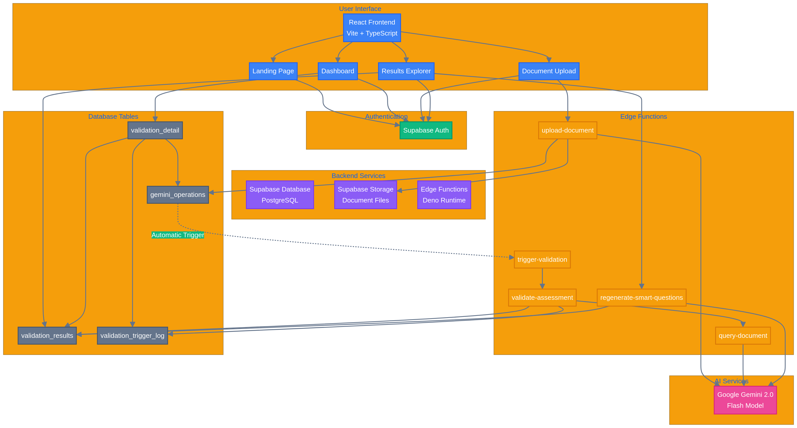
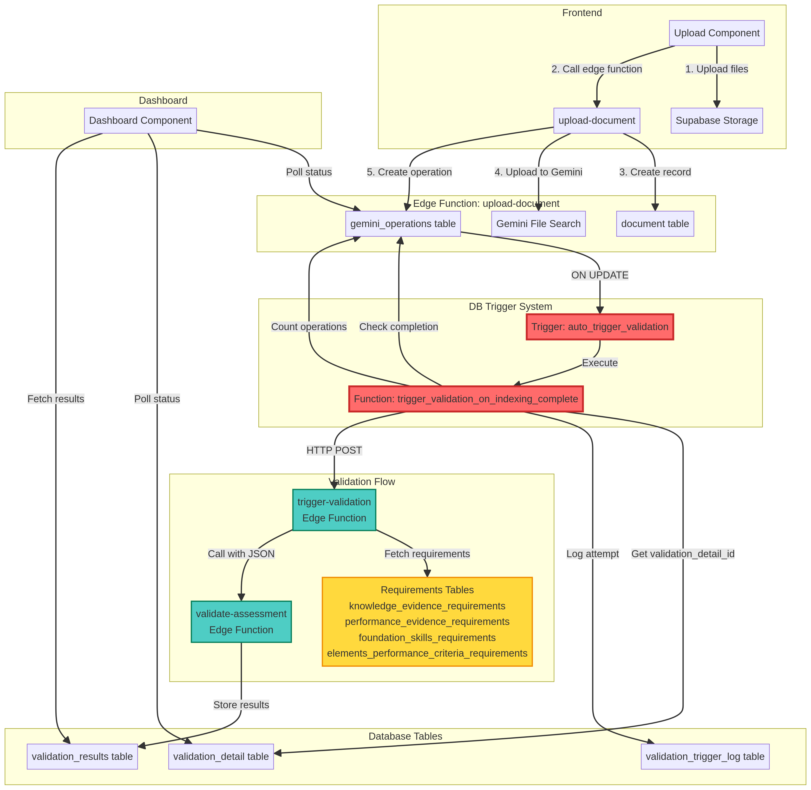

<div align="center">


# NytroAI

**Validate Training Assessments with AI in Minutes**

[](https://figma.com)
[](https://builder.io)
[](https://deepmind.google/technologies/gemini/)

[Get Started](#-quick-start) • [Documentation](./docs) • [Report Issue](https://github.com/KevinDyerAU/NytroAI/issues)

</div>

---

## What is NytroAI?

NytroAI helps Australian RTOs (Registered Training Organisations) validate their training assessments against unit requirements using AI. Upload your assessment documents, and get instant feedback on compliance, gaps, and recommendations.

### Why Use NytroAI?

**Save Time** - What takes hours manually now takes minutes with AI

**Ensure Compliance** - Automatically check against all unit requirements

**Improve Quality** - Get smart questions to fill assessment gaps

**Stay Organized** - Track all validations in one dashboard

---

## ✨ Key Features

- **AI Validation** - Automatically checks assessments against unit requirements
- **Smart Questions** - Generates questions to address gaps (with regeneration)
- **Instant Results** - Real-time validation with detailed reports
- **Easy Upload** - Drag and drop PDF assessments
- **Dashboard** - Track all validations in one place

---

## 🚀 Quick Start

### 1. Get Your API Keys

You'll need two free accounts:

- **Supabase** (database) - [Sign up here](https://supabase.com)
- **Google AI Studio** (AI) - [Get API key here](https://aistudio.google.com/app/apikey)

### 2. Install

```bash
# Clone the repository
git clone https://github.com/KevinDyerAU/NytroAI.git
cd NytroAI

# Install dependencies
npm install
```

### 3. Configure

Create a `.env.local` file with your API keys:

```env
GEMINI_API_KEY=your_gemini_api_key
SUPABASE_URL=your_supabase_url
SUPABASE_ANON_KEY=your_supabase_anon_key
```

### 4. Setup Database

```bash
# Link to your Supabase project
supabase link --project-ref your_project_ref

# Setup database (one command!)
supabase db push
```

### 5. Run

```bash
npm run dev
```

Open `http://localhost:5173` in your browser. Done! 🎉

---

## 📖 How It Works

### Instant Upload Process

```
Upload (Instant) → Background Processing → Get Results
```

1. **Upload** - Drag and drop your assessment PDF → **Completes in <1 second!**
2. **Continue Working** - Close browser, upload more files, or check Dashboard
3. **Automatic Processing** - AI indexes and validates in the background
4. **Review Results** - Dashboard shows real-time progress and results

### What Happens Behind the Scenes


*Complete upload and validation flow showing DB trigger automation*

**Upload Phase (<1 Second)**
- Files upload to secure storage
- ✅ **Upload complete!** You can continue working immediately
- No waiting for processing
- Can close browser right away

**Background Processing (Automatic - Fire-and-Forget)**
- Edge function creates document records (async)
- AI indexes documents with Gemini File Search
- Database trigger automatically starts validation
- Requirements fetched as structured JSON
- Each requirement validated individually
- Results stored in database
- **All happens in background - no user waiting required**

**Results (Real-time)**
- Dashboard polls for status updates
- See progress as validation completes
- Check anytime - processing continues even if browser closed
- Export detailed compliance report when ready

---

## 💳 Credit System

NytroAI uses a dual-credit system to manage usage for different AI operations:

### Credit Types

#### 1. Validation Credits
- **Used for:** Running AI validation on assessments (1 credit per validation)
- **Default allocation:** Based on subscription tier
- **Base credits per tier:**
  - **Starter:** 10 validations/month
  - **Professional:** 50 validations/month  
  - **Enterprise:** 200 validations/month
  - **Unlimited:** 1000 validations/month

#### 2. AI Credits
- **Used for:** AI-powered features like smart question generation (1 credit per operation)
- **Default allocation:** Based on subscription tier
- **Base credits per tier:**
  - **Starter:** 100 AI operations/month
  - **Professional:** 500 AI operations/month
  - **Enterprise:** 2000 AI operations/month
  - **Unlimited:** 10000 AI operations/month

### How Credits Work

```
Subscription Credits (Base) + Additional Credits (Purchased) = Total Available Credits
```

**Example:**
- Professional subscription: **50 validation credits** (base)
- Purchase additional: **+ 25 validation credits**
- **Total available: 75 validation credits**

### Credit Consumption

**Validation Credits:**
- ✅ Consumed when starting a new validation (1 credit)
- ✅ Deducted immediately when you click "Start Validation"
- ✅ Not refunded if validation fails (to prevent abuse)
- ✅ Dashboard shows: `Current / Total` (e.g., "8 / 10 credits")

**AI Credits:**
- ✅ Consumed when generating smart questions (1 credit per question)
- ✅ Consumed when using AI-enhanced features (1 credit per operation)
- ✅ Deducted only on successful operation
- ✅ Dashboard shows: `Current / Total` (e.g., "95 / 100 credits")

### Credit Management

#### Viewing Credits
Your current credit balance is displayed on the **Dashboard**:

```
┌─────────────────────────────┐
│ VALIDATION CREDITS          │
│ 8 / 10                      │
│ 80% Remaining               │
└─────────────────────────────┘

┌─────────────────────────────┐
│ AI CREDITS                  │
│ 95 / 100                    │
│ 95% Remaining               │
└─────────────────────────────┘
```

#### Purchasing Additional Credits
You can purchase additional credits at any time:
1. Go to **Settings → Credits**
2. Choose credit pack (Starter, Professional, Enterprise, Unlimited)
3. Complete payment via Stripe
4. Credits added instantly to your account

**Additional credit packs:**
- **Starter Pack:** 100 credits for $9.99
- **Professional Pack:** 500 credits for $39.99
- **Enterprise Pack:** 2000 credits for $129.99
- **Unlimited Pack:** 10000 credits for $499.99

### Credit Tracking

#### Edge Functions for Credit Management

```typescript
// Get validation credits
POST /functions/v1/get-validation-credits
Body: { rtoCode: "7148" }
Response: { 
  current: 8, 
  total: 10, 
  subscription: 10 
}

// Get AI credits
POST /functions/v1/get-ai-credits
Body: { rtoCode: "7148" }
Response: { 
  current: 95, 
  total: 100, 
  subscription: 100 
}

// Consume validation credit (auto-called during validation)
POST /functions/v1/consume-validation-credit
Body: { rtoCode: "7148", reason: "Validation started" }
Response: { 
  success: true, 
  remainingCredits: 7 
}

// Consume AI credit (auto-called during AI operations)
POST /functions/v1/consume-ai-credit
Body: { rtoCode: "7148", reason: "Smart question generated" }
Response: { 
  success: true, 
  remainingCredits: 94 
}
```

### Credit Renewal

- **Subscription credits reset monthly** on your billing date
- **Additional purchased credits never expire** and carry over
- **Total credits** = Subscription credits + Additional credits

**Example:**
- Month 1: 50 (subscription) + 25 (purchased) = 75 total
- You use 60 credits
- Month 2: 50 (subscription resets) + 15 (remaining purchased) = 65 total

### Low Credit Notifications

- **80% used:** Yellow warning badge
- **90% used:** Orange warning message
- **100% used:** Red error, validation/AI features blocked

### Credit Transaction History

View all credit transactions in **Settings → Credits → Transaction History**:
- Date and time
- Transaction type (subscription renewal, purchase, consumption)
- Amount (positive for additions, negative for usage)
- Reason (e.g., "Validation credit consumed for Unit BSBWHS332X")
- Balance after transaction

### Technical Implementation

Credits are managed via:
- **Database tables:** `validation_credits`, `ai_credits`
- **Transaction tables:** `credit_transactions`, `ai_credit_transactions`
- **RPC functions:** `add_validation_credits`, `add_ai_credits`
- **Edge functions:** All credit operations use edge functions for security

See [EDGE_FUNCTION_REFACTOR.md](./EDGE_FUNCTION_REFACTOR.md) for technical details.

---

## 🏗️ Backend Architecture: RPC vs Edge Functions

NytroAI uses a hybrid backend architecture combining **PostgreSQL RPC Functions** and **Supabase Edge Functions**:

```
┌──────────────────────────────────────────────────────────────┐
│                    Frontend (React)                          │
└────────────┬─────────────────────────┬──────────────────────┘
             │                         │
             │                         │
             ▼                         ▼
   ┌─────────────────────┐   ┌──────────────────┐
   │  Edge Functions     │   │  Direct DB       │
   │  (Deno/TypeScript)  │   │  Access          │
   │                     │   │                  │
   │  • Business logic   │   │  • Simple CRUD   │
   │  • External APIs    │   │  • Real-time     │
   │  • File handling    │   │  • RLS enforced  │
   │  • AI integration   │   │                  │
   └──────────┬──────────┘   └────────┬─────────┘
              │                       │
              │ Can call RPC          │
              ▼                       ▼
   ┌──────────────────────────────────────────┐
   │         PostgreSQL Database              │
   │                                          │
   │  ┌────────────────────────────────────┐  │
   │  │  RPC Functions (Stored Procedures)│  │
   │  │  • add_ai_credits                 │  │
   │  │  • add_validation_credits         │  │
   │  │  • Atomic transactions            │  │
   │  └────────────────────────────────────┘  │
   │                                          │
   │  ┌────────────────────────────────────┐  │
   │  │  Tables                            │  │
   │  │  • RTO, ai_credits, documents...  │  │
   │  └────────────────────────────────────┘  │
   └──────────────────────────────────────────┘
```

### When to Use Each

**Edge Functions** (13 deployed)
- ✅ Complex workflows (validation, document processing)
- ✅ External API calls (Gemini AI, Stripe, web scraping)
- ✅ File handling and storage operations
- ✅ Service role access (bypass RLS)
- ✅ Examples: `upload-document`, `validate-assessment`, `get-validation-credits`

**RPC Functions** (2 deployed)
- ✅ Atomic database transactions
- ✅ Credit operations (add/subtract with transaction logging)
- ✅ Fast execution (no network overhead)
- ✅ Examples: `add_ai_credits`, `add_validation_credits`

**Direct Database Access**
- ✅ Simple CRUD operations
- ✅ Real-time subscriptions
- ✅ User-specific queries (RLS enforced)

### Typical Flow: Adding Credits

```
1. Frontend → Edge Function (validate request, check auth)
2. Edge Function → RPC Function (atomic transaction)
3. RPC Function → Database (update credits + log transaction)
4. Response → Frontend (new balance displayed)
```

**Read more:** [RPC vs Edge Functions Guide](./docs/RPC_VS_EDGE_FUNCTIONS.md)

---

## 🎯 What Gets Validated?

NytroAI checks your assessment against:

- ✅ Knowledge Evidence
- ✅ Performance Evidence
- ✅ Foundation Skills
- ✅ Elements & Performance Criteria
- ✅ Assessment Conditions

For each requirement, you get:
- **Status** - Met, Partial, or Not Met
- **Reasoning** - Why the AI made this decision
- **Evidence** - Which questions in your assessment address this
- **Smart Question** - A question you can add to fill gaps

---

## 📚 Documentation

- **[Quick Start Guide](./docs/QUICK_START.md)** - Get up and running in 5 minutes
- **[User Guide](./docs/USER_GUIDE.md)** - How to use NytroAI
- **[FAQ](./docs/FAQ.md)** - Common questions answered
- **[Troubleshooting](./docs/TROUBLESHOOTING.md)** - Fix common issues

**For Developers:**
- **[Developer Guide](./docs/DEVELOPER_GUIDE.md)** - Technical documentation
- **[RPC vs Edge Functions](./docs/RPC_VS_EDGE_FUNCTIONS.md)** - Backend architecture guide
- **[AI Credit Consumption](./docs/AI_CREDIT_CONSUMPTION.md)** - AI credit usage policy
- **[Edge Function Refactor](./EDGE_FUNCTION_REFACTOR.md)** - Migration documentation
- **[Contributing](./CONTRIBUTING.md)** - How to contribute
- **[Changelog](./CHANGELOG.md)** - What's new

---

## 🐛 Common Issues



*Complete system architecture showing frontend, backend, AI services, and database relationships.*

### Technology Stack

### "Validation not starting"
**Solution:** Make sure you ran `supabase db push` to setup the database triggers.

### "No API key found"
**Solution:** Check your `.env.local` file has the correct keys.

**Infrastructure:**
- Supabase cloud database
- Supabase Edge Functions (Deno runtime)
- Google Gemini 2.0 API

### Validation Flow


*Detailed sequence diagram showing the complete validation process from upload to results.*

For detailed architecture documentation, see [docs/ARCHITECTURE.md](./docs/ARCHITECTURE.md)

---

## 🔧 Configuration

### Environment Variables

| Variable | Description | Required |
|----------|-------------|----------|
| `GEMINI_API_KEY` | Google Gemini API key | ✅ Yes |
| `SUPABASE_URL` | Supabase project URL | ✅ Yes |
| `SUPABASE_ANON_KEY` | Supabase anonymous key | ✅ Yes |

### Supabase Configuration

1. **Database Setup**
   - Run migrations in `supabase/migrations/`
   - Verify tables created correctly
   - Check RLS policies are enabled

2. **Edge Functions**
   - Deploy all functions in `supabase/functions/`
   - Verify function logs for errors
   - Test with sample data

3. **Storage**
   - Configure document storage bucket
   - Set up CORS policies
   - Enable public access if needed

4. **Automatic Validation Trigger** (Built-in)
   - Validation starts automatically after document indexing
   - No manual triggering or polling required
   - Works even if browser is closed
   
   **How It Works:**
   
   
   
   *Database trigger system that automates validation workflow*
   
   ```sql
   -- Trigger automatically fires when indexing completes
   CREATE TRIGGER auto_trigger_validation
     AFTER UPDATE ON gemini_operations
     FOR EACH ROW
     EXECUTE FUNCTION trigger_validation_on_indexing_complete();
   ```
   
   **Benefits:**
   - ⚡ **Instant upload** - Completes in <1 second, no waiting
   - 🚀 **Fire-and-forget** - Processing happens in background
   - 📉 **Zero polling** - No frontend API calls during upload
   - 🔒 **100% reliable** - Database triggers are atomic and guaranteed
   - 🎯 **Zero overhead** - Minimal database impact
   - 🔄 **Automatic retry** - Failed validations can be retried easily
   - 🚪 **Close browser** - Processing continues even if browser closed
   
   **Technical Details:**
   - Trigger monitors `gemini_operations` table
   - When all operations complete for a validation
   - Automatically calls `trigger-validation` edge function
   - Fetches requirements as JSON from database
   - Validates each requirement individually
   - Stores results in `validation_results` table
   
   See [SIMPLIFIED_UPLOAD_FLOW.md](./SIMPLIFIED_UPLOAD_FLOW.md) for complete documentation.

---

## 🐛 Troubleshooting

### Common Issues

#### ⏱️ Request Timeout Errors

**Symptom:** "Request timed out after 30/45 seconds"

**Solution:**
1. Check edge functions are deployed:
   ```bash
   supabase functions list
   ```
2. Deploy missing functions:
   ```bash
   supabase functions deploy [function-name]
   ```
3. Verify in [Supabase Dashboard](https://supabase.com/dashboard)

See [docs/guides/ERROR_HANDLING.md](./docs/guides/ERROR_HANDLING.md) for more details.

#### 🗃️ Database Errors

**Symptom:** "Could not choose the best candidate function"

**Solution:**
1. Apply Phase 3.2 migration:
   ```bash
   supabase db push
   ```
2. Verify migration in SQL Editor
3. Check [Migration Guide](./docs/migration/MIGRATION_GUIDE.md)

#### 📄 Validation Not Triggering

**Symptom:** Status stuck at "DocumentProcessing"

**Solution:**
1. Check database column names (should be snake_case)
2. Verify `doc_extracted` and `extract_status` fields
3. See [Phase 3.3 Fixes](./docs/phases/PHASE3.3_SUMMARY.md)

### Getting Help

- **Documentation:** Check [docs/guides/ERROR_HANDLING.md](./docs/guides/ERROR_HANDLING.md)
- **Issues:** [Create an issue](https://github.com/KevinDyerAU/NytroAI/issues)
- **Discussions:** [GitHub Discussions](https://github.com/KevinDyerAU/NytroAI/discussions)

---

## 🧪 Testing

### Run Tests

```bash
# Unit tests
npm test

# Integration tests
npm run test:integration

# E2E tests
npm run test:e2e
```

### Test Coverage

```bash
npm run test:coverage
```

---

## 📦 Deployment

### Production Build

```bash
# Build for production
npm run build

# Preview production build
npm run preview
```

### Deploy to Google AI Studio

1. Build the application
2. Upload to AI Studio
3. Configure environment variables
4. Deploy edge functions to Supabase

See [docs/guides/DEPLOYMENT.md](./docs/guides/DEPLOYMENT.md) for detailed instructions.

---

## 🤝 Contributing

We welcome contributions! Here's how:

1. Fork the repository
2. Create a feature branch
3. Make your changes
4. Submit a Pull Request

See [CONTRIBUTING.md](./CONTRIBUTING.md) for detailed guidelines.

---

## 📄 License

MIT License - see [LICENSE](LICENSE) file for details.

---

## 🙏 Built With

- **Figma** - Design
- **Builder.io** - Development
- **Windsurf** - Development environment
- **Google Gemini 2.0** - AI validation
- **Supabase** - Database and backend
- **React** - Frontend framework

---

## 📞 Support

- **Issues:** [GitHub Issues](https://github.com/KevinDyerAU/NytroAI/issues)
- **Discussions:** [GitHub Discussions](https://github.com/KevinDyerAU/NytroAI/discussions)
- **Email:** [Contact Kevin Dyer](https://github.com/KevinDyerAU)

---

<div align="center">

**Made with ❤️ for Australian RTOs**

[⭐ Star us on GitHub](https://github.com/KevinDyerAU/NytroAI) if you find this useful!

</div>
