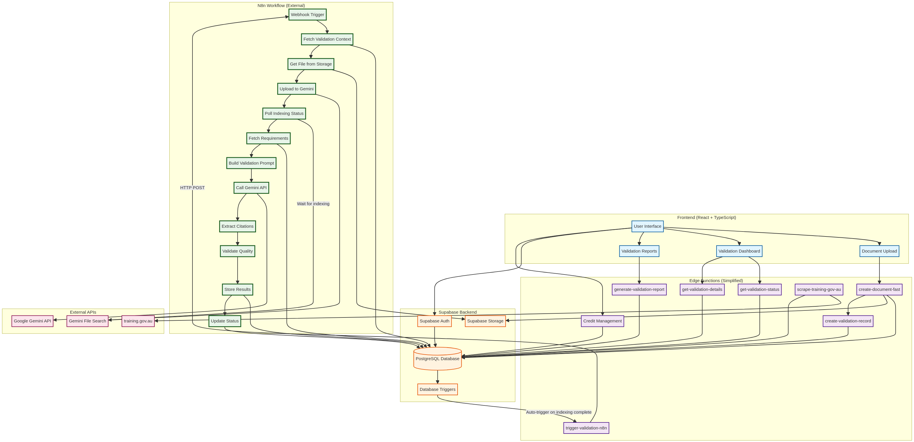

<div align="center">


# NytroAI

**Validate Training Assessments with AI in Minutes**

[](https://figma.com)
[](https://builder.io)
[](https://deepmind.google/technologies/gemini/)
[](https://n8n.io)

[Get Started](#-quick-start) • [Documentation](./docs) • [Architecture](./ARCHITECTURE_N8N.md) • [Report Issue](https://github.com/KevinDyerAU/NytroAI/issues)

</div>

---

## What is NytroAI?

NytroAI helps Australian RTOs (Registered Training Organisations) validate their training assessments against unit requirements using AI. Upload your assessment documents, and get instant feedback on compliance, gaps, and recommendations - **with citations and page numbers** to back every validation.

### Why Use NytroAI?

**Save Time** - What takes hours manually now takes minutes with AI

**Ensure Compliance** - Automatically check against all unit requirements with evidence

**Improve Quality** - Get smart questions to fill assessment gaps

**Stay Organized** - Track all validations in one dashboard with citation metrics

**Trust the Results** - Every validation includes page numbers and confidence scores

---

## ✨ Key Features

### Core Validation
- ✅ **AI Validation** - Automatically checks assessments against unit requirements
- ✅ **Citation Extraction** - Every validation includes page numbers and evidence excerpts
- ✅ **Quality Metrics** - Automatic quality assessment with confidence scores
- ✅ **Instant Upload** - Documents uploaded in <1 second (background processing)
- ✅ **RAG-based Analysis** - Retrieval-Augmented Generation with Gemini File Search

### Smart Features
- 🧠 **Smart Questions** - Generates questions to address gaps (with regeneration)
- 📊 **Dashboard** - Track all validations with citation coverage metrics
- 📄 **Detailed Reports** - PDF/Word reports with citations and evidence
- 🔄 **Batch Processing** - Validate multiple documents simultaneously

### Developer Features
- 🚀 **n8n Integration** - Complex validation workflow managed externally
- 🏗️ **Simplified Backend** - 33% fewer edge functions (8 removed)
- 📈 **Monitoring** - Built-in quality metrics and execution tracking
- 🔧 **Easy Deployment** - One-command database setup

---

## 🏗️ Architecture

NytroAI uses a **hybrid architecture** combining Supabase backend with n8n workflow automation:



### Technology Stack

**Frontend**: React 18 + TypeScript + Vite + TailwindCSS  
**Backend**: Supabase (PostgreSQL + Auth + Storage + Edge Functions)  
**Workflow**: n8n (External workflow automation)  
**AI**: Google Gemini 2.5 Flash with File Search  
**Scraping**: training.gov.au (official VET requirements)

### Key Components

1. **Frontend** - User uploads documents, views results
2. **Supabase** - Database, auth, storage, simplified edge functions
3. **n8n Workflow** - Handles indexing, validation, citation extraction
4. **Gemini File Search** - RAG-based document analysis with grounding

**See [ARCHITECTURE_N8N.md](./ARCHITECTURE_N8N.md) for complete documentation.**

---

## 🚀 Quick Start

### Prerequisites

You'll need:

1. **Supabase Account** (database) - [Sign up here](https://supabase.com)
2. **Google AI Studio** (AI) - [Get API key here](https://aistudio.google.com/app/apikey)
3. **n8n Instance** (workflow automation) - [Self-host](https://docs.n8n.io/hosting/) or [Cloud](https://n8n.io)

### 1. Clone Repository

```bash
git clone https://github.com/KevinDyerAU/NytroAI.git
cd NytroAI
```

### 2. Install Dependencies

```bash
npm install
```

### 3. Configure Environment

Create a `.env.local` file:

```env
# Supabase
VITE_SUPABASE_URL=your_supabase_url
VITE_SUPABASE_ANON_KEY=your_supabase_anon_key

# Google AI
VITE_GEMINI_API_KEY=your_gemini_api_key

# n8n (optional - for local testing)
VITE_N8N_WEBHOOK_URL=https://n8n-gtoa.onrender.com/webhook/validate-document
```

### 4. Setup Database

```bash
# Link to your Supabase project
supabase link --project-ref your_project_ref

# Run migrations (includes n8n integration)
supabase db push

# Enable pg_net extension (required for auto-trigger)
supabase db execute "CREATE EXTENSION IF NOT EXISTS pg_net;"
```

### 5. Setup n8n Workflow

#### Option A: Use Hosted n8n (Recommended)

The workflow is already hosted at:
```
https://n8n-gtoa.onrender.com/webhook/validate-document
```

No setup needed! Just use the default `VITE_N8N_WEBHOOK_URL`.

#### Option B: Self-Host n8n

1. **Install n8n**:
   ```bash
   npm install -g n8n
   ```

2. **Import workflow**:
   - Start n8n: `n8n start`
   - Open http://localhost:5678
   - Import `n8n-workflow-with-unitLink.json`

3. **Configure credentials**:
   - **Supabase PostgreSQL**: Connection string from Supabase
   - **Google AI API Key**: Your Gemini API key
   - **Supabase Storage Auth**: Bearer token with anon key

4. **Activate workflow** and get webhook URL

5. **Update database**:
   ```sql
   UPDATE app_config 
   SET value = 'http://localhost:5678/webhook/validate-document'
   WHERE key = 'n8n_webhook_url';
   ```

### 6. Deploy Edge Functions

```bash
supabase login
supabase functions deploy
```

### 7. Run Frontend

```bash
npm run dev
```

Open `http://localhost:5173` in your browser. Done! 🎉

---

## 📖 How It Works

### Instant Upload Process

```
User uploads document (Instant)
  ↓
Document saved to Supabase Storage (<1 second)
  ↓
Background: Upload to Gemini File Search (10-30 seconds)
  ↓
Background: Validate against requirements (30-60 seconds)
  ↓
Background: Extract citations and quality metrics (5 seconds)
  ↓
Results available in Dashboard (with page numbers!)
```

**Total time**: 40-90 seconds (all background, user doesn't wait)

### Validation Flow (n8n)

The n8n workflow handles the complex validation process:

1. **Fetch Context** - Get unitLink, unitCode, namespace from database
2. **Get File** - Download document from Supabase Storage
3. **Upload to Gemini** - Upload with metadata (rto-code, unit-link, namespace)
4. **Poll for Indexing** - Wait for Gemini to index document (max 60 seconds)
5. **Fetch Requirements** - Get requirements from database by unitLink
6. **Build Prompt** - Construct validation prompt with requirements JSON
7. **Call Gemini** - RAG query with File Search and metadata filter
8. **Extract Citations** - Parse grounding chunks for page numbers and evidence
9. **Validate Quality** - Calculate citation coverage and confidence scores
10. **Store Results** - Save to database with citations and quality flags
11. **Update Status** - Mark validation as complete

**Key Innovation**: Metadata filtering ensures Gemini only searches relevant documents for this specific unit and validation session.

---

## 📊 Citation System

Every validation includes **grounding citations** with:

- **Page Numbers** - Exact pages where evidence was found
- **Excerpts** - Text snippets from the document
- **Confidence Scores** - AI confidence in each citation (0-1)
- **Quality Metrics** - Overall citation coverage and quality flags

### Example Validation Result

```json
{
  "requirementId": 123,
  "status": "covered",
  "evidence": "Found on page 3, section 2.1",
  "pageNumbers": [3, 4],
  "confidence": "high",
  "citations": [
    {
      "citationId": 1,
      "documentName": "assessment.pdf",
      "pageNumbers": [3],
      "excerpt": "The learner must demonstrate knowledge of...",
      "unitLink": "https://training.gov.au/Training/Details/BSBWHS332X"
    }
  ]
}
```

### Quality Flags

- ✅ **Good Quality**: Citation count > 0, coverage ≥ 80%, confidence ≥ 0.8
- ⚠️ **Low Coverage**: Citation coverage < 50%
- ⚠️ **Low Confidence**: Average confidence < 0.6
- ❌ **No Citations**: No grounding chunks found

---

## 🗂️ Project Structure

```
NytroAI/
├── src/
│   ├── services/
│   │   ├── N8nValidationService.ts       # n8n integration (NEW)
│   │   └── DocumentUploadServiceSimplified.ts
│   ├── components/
│   │   ├── dashboard.tsx                 # Main dashboard
│   │   └── maintenance/
│   │       └── TriggerValidation.tsx     # Manual trigger UI
│   ├── hooks/
│   │   ├── useValidationReport.ts        # Validation data fetching
│   │   └── useIndexingProcessor.ts       # Indexing status
│   └── types/
│       └── rto.ts                        # TypeScript types
├── supabase/
│   ├── functions/
│   │   ├── trigger-validation-n8n/       # Simplified trigger (NEW)
│   │   ├── create-document-fast/         # Document creation
│   │   ├── get-validation-status/        # Status checking
│   │   ├── generate-validation-report/   # PDF/Word reports
│   │   ├── scrape-training-gov-au/       # Data scraping
│   │   └── [15 other functions]          # See ARCHITECTURE_N8N.md
│   └── migrations/
│       └── 20251126_n8n_integration.sql  # n8n migration (NEW)
├── docs/
│   ├── architecture-n8n.mmd              # Architecture diagram source
│   ├── architecture-n8n.png              # Rendered diagram
│   └── N8N_INTEGRATION.md                # n8n setup guide
├── n8n-workflow-with-unitLink.json       # n8n workflow template (NEW)
├── ARCHITECTURE_N8N.md                   # Complete architecture docs (NEW)
├── README.md                             # This file
└── package.json
```

---

## 🔧 Development

### Running Locally

```bash
# Start Supabase (local development)
supabase start

# Start frontend dev server
npm run dev

# Start n8n (if self-hosting)
n8n start
```

### Building for Production

```bash
# Build frontend
npm run build

# Deploy edge functions
supabase functions deploy

# Deploy frontend (example: Netlify)
netlify deploy --prod --dir=dist
```

### Database Migrations

```bash
# Create new migration
supabase migration new my_migration_name

# Apply migrations
supabase db push

# Reset database (WARNING: Deletes all data)
supabase db reset
```

### Testing

```bash
# Run tests
npm test

# Test edge function locally
supabase functions serve trigger-validation-n8n

# Test n8n workflow
curl -X POST http://localhost:5678/webhook/validate-document \
  -H "Content-Type: application/json" \
  -d '{"validationDetailId": 123, "documentId": 456, ...}'
```

---

## 📚 Documentation

- **[ARCHITECTURE_N8N.md](./ARCHITECTURE_N8N.md)** - Complete architecture documentation
- **[docs/N8N_INTEGRATION.md](./docs/N8N_INTEGRATION.md)** - n8n setup and configuration
- **[MIGRATION_GUIDE.md](./MIGRATION_GUIDE.md)** - Migrating from v1.0 to v2.0 (n8n)
- **[EDGE_FUNCTIONS_ANALYSIS.md](./EDGE_FUNCTIONS_ANALYSIS.md)** - Edge function changes

---

## 🚀 Deployment

### Production Checklist

- [ ] Supabase project created
- [ ] Database migrations applied
- [ ] `pg_net` extension enabled
- [ ] Edge functions deployed
- [ ] n8n workflow imported and activated
- [ ] n8n webhook URL configured in `app_config`
- [ ] Frontend environment variables set
- [ ] Frontend deployed to hosting
- [ ] Test validation end-to-end
- [ ] Monitor n8n execution logs

### Environment Variables

**Frontend** (`.env.local`):
```env
VITE_SUPABASE_URL=https://xxx.supabase.co
VITE_SUPABASE_ANON_KEY=eyJhbGc...
VITE_GEMINI_API_KEY=AIza...
VITE_N8N_WEBHOOK_URL=https://n8n-gtoa.onrender.com/webhook/validate-document
```

**Edge Functions** (Supabase dashboard):
```env
GEMINI_API_KEY=AIza...
SUPABASE_URL=https://xxx.supabase.co
SUPABASE_SERVICE_ROLE_KEY=eyJhbGc...
```

**n8n Workflow** (n8n credentials):
- **Supabase PostgreSQL**: Connection string
- **Google AI API Key**: Gemini API key
- **Supabase Storage Auth**: Bearer token

---

## 🔍 Monitoring

### Database Queries

**Check validation status**:
```sql
SELECT 
  vd.id,
  vd.status,
  vs.unitCode,
  COUNT(vr.id) as result_count,
  AVG(vr.citation_coverage) as avg_coverage
FROM validation_detail vd
LEFT JOIN validation_summary vs ON vd.summary_id = vs.id
LEFT JOIN validation_results vr ON vr.validation_detail_id = vd.id
WHERE vd.created_at > NOW() - INTERVAL '1 day'
GROUP BY vd.id, vs.unitCode;
```

**Check citation quality**:
```sql
SELECT 
  unit_code,
  AVG(citation_count) as avg_citations,
  AVG(citation_coverage) as avg_coverage,
  COUNT(*) FILTER (WHERE (quality_flags->>'goodQuality')::boolean) as good_quality_count
FROM validation_results
WHERE created_at > NOW() - INTERVAL '7 days'
GROUP BY unit_code;
```

### n8n Monitoring

- **Workflow Executions**: n8n dashboard → Executions
- **Error Rate**: Filter by "Error" status
- **Execution Time**: Average time per validation (should be 60-90 seconds)

### Logs

```bash
# Edge function logs
supabase functions logs trigger-validation-n8n --tail

# Database logs
supabase logs db --tail
```

---

## 🐛 Troubleshooting

### Validation not triggering

**Check**:
1. Is `pg_net` extension enabled?
2. Is n8n webhook URL correct in `app_config`?
3. Are all `gemini_operations` for this validation complete?

**Debug**:
```sql
SELECT * FROM app_config WHERE key = 'n8n_webhook_url';

SELECT validation_detail_id, status, COUNT(*)
FROM gemini_operations
WHERE validation_detail_id = 123
GROUP BY validation_detail_id, status;
```

### No grounding chunks found

**Check**:
1. Is metadata set correctly during upload?
2. Does metadata filter match uploaded metadata?
3. Is namespace unique per validation session?

**Debug** (in n8n):
```javascript
console.log('Metadata filter:', 
  'namespace="' + namespace + '" AND unit-link="' + unitLink + '"'
);
```

### Requirements not found

**Check**:
1. Does `validation_summary.unitLink` exist?
2. Do requirements tables have `unit_url` column?
3. Does `unit_url` match `UnitOfCompetency.Link`?

**Debug**:
```sql
SELECT 
  vs.unitLink,
  uoc.Link,
  (SELECT COUNT(*) FROM knowledge_evidence_requirements WHERE unit_url = uoc.Link) as ke_count
FROM validation_summary vs
LEFT JOIN "UnitOfCompetency" uoc ON vs.unitLink = uoc.Link
WHERE vs.id = 45;
```

**See [ARCHITECTURE_N8N.md](./ARCHITECTURE_N8N.md#troubleshooting) for more troubleshooting tips.**

---

## 🤝 Contributing

We welcome contributions! Here's how:

1. **Fork** the repository
2. **Create** a feature branch: `git checkout -b feature/my-feature`
3. **Make** your changes (code + tests + docs)
4. **Test** locally: `npm run dev` + `supabase start`
5. **Commit**: `git commit -m "feat: Add my feature"`
6. **Push**: `git push origin feature/my-feature`
7. **Create** a Pull Request

### Development Guidelines

- **Code Style**: Follow existing TypeScript/React patterns
- **Edge Functions**: Keep them simple (complex logic goes in n8n)
- **Documentation**: Update docs for any architecture changes
- **Testing**: Test edge functions and n8n workflow
- **Migrations**: Always include rollback SQL

---

## 📝 License

MIT License - See [LICENSE](./LICENSE) file for details

---

## 🙏 Acknowledgments

- **Supabase** - Amazing backend platform
- **Google Gemini** - Powerful AI with File Search
- **n8n** - Workflow automation made easy
- **training.gov.au** - Official VET requirements source
- **React + Vite** - Fast frontend development

---

## 📧 Support

- **Documentation**: See `docs/` folder
- **Issues**: [GitHub Issues](https://github.com/KevinDyerAU/NytroAI/issues)
- **Email**: support@nytroai.com

---

## 🗺️ Roadmap

### v2.1 (Next)
- [ ] Multi-document validation
- [ ] Custom validation prompts
- [ ] Batch processing for qualifications
- [ ] Enhanced citation UI

### v2.2 (Future)
- [ ] REST API for third-party integrations
- [ ] Custom report templates
- [ ] Advanced analytics dashboard
- [ ] Mobile app

---

<div align="center">

**Built with ❤️ by the NytroAI team**

[⬆ Back to Top](#nytroai)

</div>
