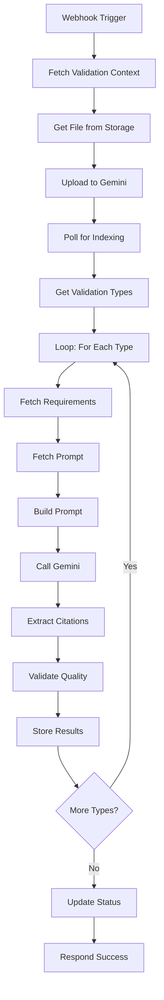

# N8n Multi-Validation Implementation Guide

**Date**: November 26, 2025  
**Version**: 4.0  
**Status**: Ready for Implementation

---

## Overview

This document provides a complete implementation guide for the n8n multi-validation workflow that processes **6 validation types** separately, each with its own requirements, prompts, and citation extraction.

---

## What's Included

### 1. Database Migration
**File**: `20251126_prompt_table_and_validation_results.sql`

**Creates**:
- `prompt` table with versioning and current flag
- Updated `validation_results` table with citation columns
- Helper functions (`get_active_prompt`, `create_prompt_version`, `set_current_prompt`)
- Views (`active_prompts`, `validation_results_summary`)
- Default prompts for all 6 validation types

**Run**:
```bash
cd /home/ubuntu/NytroAI
supabase db push
```

---

### 2. N8n Workflow Architecture
**File**: `N8N_MULTI_VALIDATION_ARCHITECTURE.md`

**Describes**:
- Complete workflow structure (59 nodes)
- Main flow (nodes 1-9)
- 6 sub-flows (8 nodes each)
- Node configurations and code
- Data flow diagrams

---

### 3. Simplified Approach

Given the complexity of 59 nodes, I recommend a **simplified approach** that's easier to implement and maintain:

#### Option A: Single Workflow with Loop (Recommended)

Instead of 6 separate sub-flows, use a **loop** to process each validation type:

```
1. Webhook Trigger
2. Fetch Validation Context
3. Get File from Storage
4. Upload to Gemini (if not already uploaded)
5. Poll for Indexing
6. Get All Validation Types to Process
7. LOOP START (for each validation type)
   ├─ Fetch Requirements
   ├─ Fetch Prompt
   ├─ Build Prompt
   ├─ Call Gemini
   ├─ Extract Citations
   ├─ Validate Quality
   └─ Store Results
8. LOOP END
9. Update Overall Status
10. Respond Success
```

**Total Nodes**: ~15 (vs 59)

**Benefits**:
- Much simpler to implement
- Easier to debug
- Easier to update (change one loop, affects all types)
- Same functionality as 59-node version

---

#### Option B: Separate Workflows per Validation Type

Create 6 separate n8n workflows, one for each validation type:

1. `validate-knowledge-evidence`
2. `validate-performance-evidence`
3. `validate-foundation-skills`
4. `validate-elements-criteria`
5. `validate-assessment-conditions`
6. `validate-assessment-instructions`

**Benefits**:
- Complete isolation between types
- Can deploy/update independently
- Easier to understand (each workflow is simple)

**Drawbacks**:
- Need to call 6 webhooks (can be done in parallel)
- More workflows to manage

---

## Recommended Implementation: Loop Approach

### Workflow Structure



---

### Key Nodes

#### Node 6: Get Validation Types to Process

**Type**: Function  
**Code**:
```javascript
// Get validation_type_id from context
const validationTypeId = $node['Fetch Validation Context'].json.validation_type_id;

// Map validation type IDs to table names and types
const validationTypes = [
  { id: 1, name: 'knowledge_evidence', table: 'knowledge_evidence_requirements', field: 'knowledge_point' },
  { id: 2, name: 'elements_criteria', table: 'elements_performance_criteria_requirements', field: 'element_text' },
  { id: 3, name: 'performance_evidence', table: 'performance_evidence_requirements', field: 'performance_point' },
  { id: 4, name: 'assessment_conditions', table: 'UnitOfCompetency', field: 'ac' },
  { id: 5, name: 'foundation_skills', table: 'foundation_skills_requirements', field: 'skill_text' },
  { id: 7, name: 'assessment_instructions', table: 'UnitOfCompetency', field: 'ac_epc' }
];

// If specific validation type requested, process only that one
if (validationTypeId && validationTypeId !== 10) {
  const type = validationTypes.find(t => t.id === validationTypeId);
  return [type];
}

// Otherwise, process all types (for full validation)
return validationTypes;
```

**Output**:
```json
[
  { "id": 1, "name": "knowledge_evidence", "table": "knowledge_evidence_requirements", "field": "knowledge_point" },
  { "id": 2, "name": "elements_criteria", "table": "elements_performance_criteria_requirements", "field": "element_text" },
  ...
]
```

---

#### Node 7: Loop Start

**Type**: Split In Batches  
**Batch Size**: 1  
**Options**: 
- Reset: true
- Input Data: `{{ $json }}`

---

#### Node 8: Fetch Requirements

**Type**: PostgreSQL or Function (conditional)

**Code** (Function approach):
```javascript
const validationType = $json;
const context = $node['Fetch Validation Context'].json;
const supabase = /* Supabase client */;

let requirements = [];

if (validationType.table === 'UnitOfCompetency') {
  // Special handling for AC and AI
  if (validationType.name === 'assessment_conditions') {
    // Fetch AC from UnitOfCompetency
    const { data } = await supabase
      .from('UnitOfCompetency')
      .select('ac, Link')
      .eq('Link', context.unit_link)
      .single();
    
    requirements = [{
      id: 999999,
      number: '1',
      text: data.ac
    }];
  } else if (validationType.name === 'assessment_instructions') {
    // Fetch AC + EPC from UnitOfCompetency
    const { data } = await supabase
      .from('UnitOfCompetency')
      .select('ac, epc, Link')
      .eq('Link', context.unit_link)
      .single();
    
    const text = `${data.ac || ''}  -  ${data.epc || ''}`.trim();
    requirements = [{
      id: 999998,
      number: '1',
      text: text
    }];
  }
} else {
  // Fetch from requirements table
  const { data } = await supabase
    .from(validationType.table)
    .select('*')
    .eq('unit_url', context.unit_link)
    .order('id', { ascending: true });
  
  requirements = data.map((row, index) => ({
    id: row.id,
    number: row.requirement_number || (index + 1).toString(),
    text: row[validationType.field]
  }));
}

return {
  validationType: validationType.name,
  validationTypeId: validationType.id,
  requirements: requirements
};
```

---

#### Node 9: Fetch Prompt

**Type**: PostgreSQL  
**Query**:
```sql
SELECT prompt
FROM prompt
WHERE validation_type_id = {{ $json.validationTypeId }}
  AND current = true
LIMIT 1
```

---

#### Node 10: Build Prompt

**Type**: Function  
**Code**:
```javascript
const prompt = $node['Fetch Prompt'].json.prompt;
const context = $node['Fetch Validation Context'].json;
const data = $json;

// Format requirements as JSON
const requirementsJSON = JSON.stringify(
  data.requirements.map(req => ({
    requirementId: req.id,
    requirementNumber: req.number,
    requirementText: req.text
  })),
  null,
  2
);

// Replace placeholders
const finalPrompt = prompt
  .replace(/{unitCode}/g, context.unitCode)
  .replace(/{unitTitle}/g, context.unit_title)
  .replace(/{requirements}/g, requirementsJSON);

return {
  ...data,
  prompt: finalPrompt
};
```

---

#### Node 11: Call Gemini

**Type**: HTTP Request  
**URL**: `https://generativelanguage.googleapis.com/v1beta/models/gemini-2.0-flash-exp:generateContent`

**Body**:
```javascript
={{
  JSON.stringify({
    contents: [{ parts: [{ text: $json.prompt }] }],
    generationConfig: {
      temperature: 0.1,
      responseMimeType: "application/json",
      responseSchema: {
        type: "object",
        properties: {
          validations: {
            type: "array",
            items: {
              type: "object",
              properties: {
                requirementId: { type: "integer" },
                status: { type: "string", enum: ["covered", "partial", "not_covered", "unclear"] },
                evidence: { type: "string" },
                pageNumbers: { type: "array", items: { type: "integer" } },
                confidence: { type: "string", enum: ["high", "medium", "low"] }
              },
              required: ["requirementId", "status", "evidence"]
            }
          },
          overallStatus: { type: "string" },
          summary: { type: "string" }
        },
        required: ["validations", "overallStatus", "summary"]
      }
    },
    tools: [{
      fileSearchTool: {
        fileSearchConfigs: [{
          filter: {
            metadataFilter: {
              operator: "AND",
              conditions: [
                { key: "namespace", operator: "EQUAL", value: { stringValue: $node['Fetch Validation Context'].json.namespace_code } },
                { key: "unit-link", operator: "EQUAL", value: { stringValue: $node['Fetch Validation Context'].json.unit_link } }
              ]
            }
          }
        }]
      }
    }]
  })
}}
```

---

#### Node 12: Extract Citations

**Type**: Function  
**Code**: (Same as in architecture document)

---

#### Node 13: Validate Quality

**Type**: Function  
**Code**: (Same as in architecture document)

---

#### Node 14: Store Results

**Type**: PostgreSQL  
**Query**:
```sql
INSERT INTO validation_results (
  document_id,
  validation_detail_id,
  unit_code,
  unit_link,
  validation_type,
  validation_data,
  grounding_metadata,
  citation_count,
  average_confidence,
  citation_coverage,
  quality_flags
) VALUES (
  {{ $node['Webhook Trigger'].json.body.documentId }},
  {{ $node['Fetch Validation Context'].json.validation_detail_id }},
  {{ $node['Fetch Validation Context'].json.unitCode }},
  {{ $node['Fetch Validation Context'].json.unit_link }},
  {{ $json.validationType }},
  {{ JSON.stringify({ validations: $json.validations, overallStatus: $json.overallStatus, summary: $json.summary }) }},
  {{ JSON.stringify({ allCitations: $json.allCitations, groundingSupports: $json.groundingSupports }) }},
  {{ $json.citationCount }},
  {{ $json.averageConfidence }},
  {{ $json.citationCoverage }},
  {{ JSON.stringify($json.qualityFlags) }}
)
```

---

#### Node 15: Loop End

**Type**: Split In Batches (same node as Loop Start)

---

#### Node 16: Update Overall Status

**Type**: PostgreSQL  
**Query**:
```sql
UPDATE validation_detail
SET status = 'validated', updated_at = NOW()
WHERE id = {{ $node['Fetch Validation Context'].json.validation_detail_id }}
```

---

#### Node 17: Respond Success

**Type**: Respond to Webhook  
**Body**:
```javascript
={{
  JSON.stringify({
    status: 'success',
    validationDetailId: $node['Fetch Validation Context'].json.validation_detail_id,
    message: 'All validation types processed successfully'
  })
}}
```

---

## Implementation Steps

### 1. Run Database Migration

```bash
cd /home/ubuntu/NytroAI
supabase db push
```

**Verify**:
```sql
-- Check prompt table created
SELECT * FROM prompt WHERE current = true;

-- Check validation_results columns
\d validation_results
```

---

### 2. Create N8n Workflow

**Option 1**: Import pre-built workflow (if provided)

**Option 2**: Build manually using the node descriptions above

---

### 3. Configure Credentials

- **PostgreSQL**: Supabase connection string
- **Gemini API**: API key
- **Supabase Storage**: Bearer token

---

### 4. Test Each Validation Type

```bash
# Test Knowledge Evidence
curl -X POST https://n8n.../webhook/validate-document \
  -H "Content-Type: application/json" \
  -d '{
    "validationDetailId": 123,
    "documentId": 456,
    "fileSearchStore": "rto-7148-assessments",
    "signedUrl": "https://...",
    "fileName": "assessment.pdf"
  }'
```

---

### 5. Monitor Execution

- Open n8n dashboard
- Check execution logs
- Verify all validation types processed
- Check database for results

---

## Benefits of Loop Approach

1. **Simplicity**: 15 nodes vs 59 nodes
2. **Maintainability**: Update one loop, affects all types
3. **Debugging**: Easier to trace execution
4. **Flexibility**: Easy to add new validation types
5. **Performance**: Same as 59-node version (processes sequentially anyway)

---

## Next Steps

1. ✅ Database migration created
2. ✅ Architecture documented
3. ⏳ Create n8n workflow JSON (loop approach)
4. ⏳ Test with sample data
5. ⏳ Deploy to production

---

**Recommendation**: Implement the **loop approach** first. It's simpler, easier to debug, and provides the same functionality. If you need more isolation between validation types later, you can always split into separate workflows.

---

**End of Implementation Guide**
